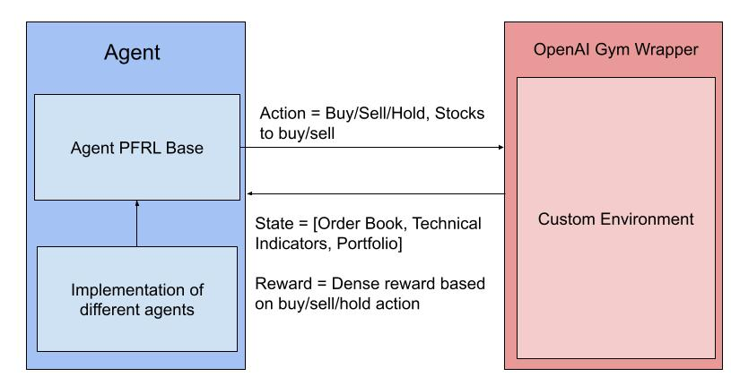
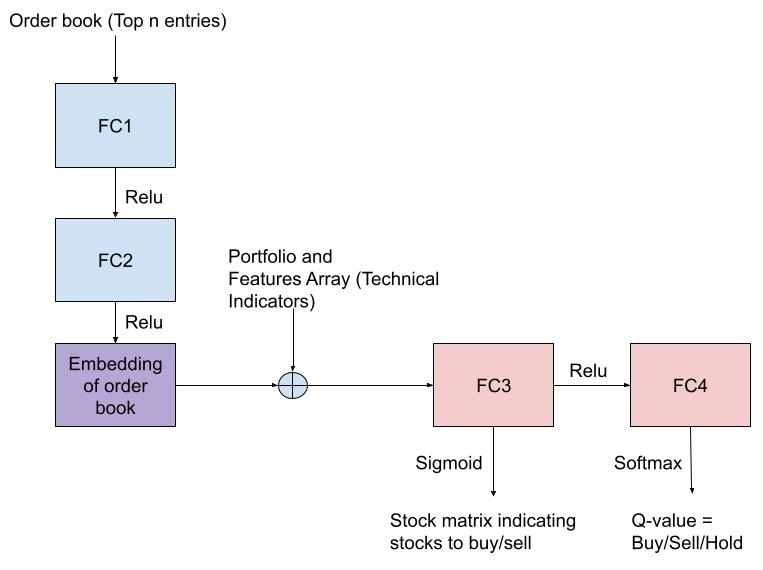

#  Reinforcement Learning for Complex Financial Time Series Analysis 

In this project, we present an environment to efficiently process high-frequency (level-2) trading data. This environment is wrapped around OpenAI's Gym interface so that it can be easily accessed by RL agents. We also train and test the performance of different RL agents on this environment. 

## Installation 
* Download [Miniconda](https://docs.conda.io/en/latest/miniconda.html) for your OS 
* Create a new conda environment as follows: 
```
conda create -n fin-rl python=3.7 pip
```
* Activate the new conda environment as follows: 
```
conda activate fin-rl
```
* Install requirements using the following command: 
```
pip install -r requirements.txt
```
* Install PyTorch by following the instructions [here.](https://pytorch.org/get-started/locally/)

## Dataset 

This project uses DEEP (Depth of the Book) IEX Trading Data available [here.](https://iextrading.com/trading/market-data/)

## System Overview 




## DDQN Agent Design 




## Usage 
* Download Depth of the Book trading data from IEX. 
* To simplify training, a subset of stocks can be chosen from among the large number of stocks using data_utils.py file. 
* Then specify the location of the file generated by data_utils.py and the original DEEP file downloaded from IEX inside the experiments section and run exp2.py to train the DDQN Agent. 

